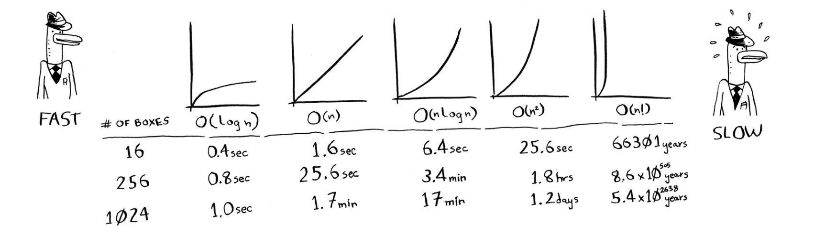
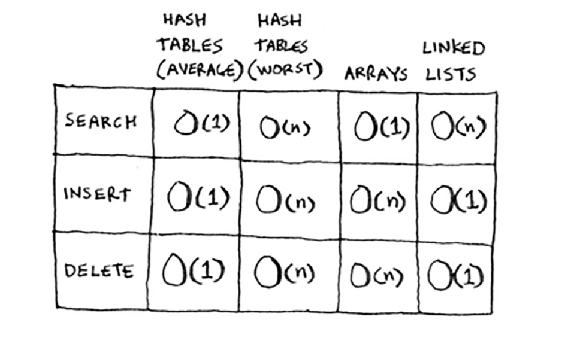

# GROKKING ALGORITHMS

## What is an algorithm?

An algorithm is a set of instructions for accomplishing a task. Every piece of code can be called an algorithm.

## Running time of algorithms

If the maximum number of guesses is the same as the size of the list, then it is called *linear time*.

The *Big O* notation tells how fast an algorithm is. It’s not enough to just know how long an algorithm takes to run. You need to know how the running time increases as the list size increases. That’s where Big O notation comes in. 

For example, suppose you have a list of size n. Simple search needs to check each element, so it will take n operations. The run time in Big O notation is *O(n)*. Where are the seconds? There are none!! Big O doesn’t tell you the speed in seconds. Big O notation lets you compare the number of operations. It tells you how fast the algorithm grows. 

Also, Big O establishes a *worst-case* run time. Along with the *worst-case* run time, it’s also important to look at the *average-case* run time. 

The following are some common Big O run times, sorted from fastest to slowest:

- **O(log n)**, known as *log time*. Example: Binary search
- **O(n)**, known as *linear time*. Example: Simple search
- **O(n * log n)** Example: A fast sorting algorithm like *quicksort*
- **O(n<sup>2</sup>)** Example: A slow sorting algorithm like *selection sort*
- **O(n!)** Example: A *really* slow algorithm like *traveling salesperson*



**BEWARE: Algorithm running times grow at different rates.**

Also check out [Big O Notation](#big-o-notation)

## Binary Search [[code](python-files/01_binary_search.py)]

Searching for a name in a phone book or when Facebook tries to verify your username, it searches through its directory of authorised usenames. This is a *search problem*. 

This problem is solved using the *binary search* algorithm. It takes a **sorted list** of elements as its input. If the element you are looking for is in that list, the algorithm returns the position of the element. Otherwise, it returns `null`. 

Binary search carries out the following steps:

- Take the center element of the ordered list
- If the center element is too high, discard the upper half of the list. Else discard the lower half of the list.
- Repeat the process again in the remaining half till the correct element is found

With binary search, you eliminate half the elements every time. Thus, for any list of *n* elements, binary search takes **log<sub>2</sub>n** steps to run in the worst case, whereas simple search will take *n* steps. Binary search runs in *logarithmic time*.

## Selection Sort [[code](python-files/02_selection_sort.py)]

Lets say you want to sort a list of items in descending order. Selection sort works in the following way:
- Go through the array of items and get the biggest number. Place it first in a separate list.
- Now, go through the array of items again and find the current biggest number and append it to the separate list
- Repeat the process till all the elements are removed from the orginal list.

Time taken for selection sort to run: *O(n<sup>2</sup>)*. Although selection sort is a neat algorithm, it is not very fast.

<details><summary><i>But why is it O(n<sup>2</sup>)? Isn't it supposed to be O(n!)</i></summary>
<p>
Yes, the algortihm doesn’t have to check a list of n elements each time. You check n elements, then n – 1, n - 2 ... 2, 1. On average, you check a list that has 1/2 × n elements. The runtime is O(n × 1/2 × n). But constants like 1/2 are ignored in Big O notation, so you just write O(n × n) or O(n<sup>2</sup>).
</p>
</details>

## Recursion

Recursion is where a function calls itself. Example:

```
def look_for_key(box): 
  for item in box:
    if item.is_a_box(): 
      look_for_key(item)
    elif item.is_a_key(): 
      print “found the key!”
```

When you write a recursive function, you have to tell it when to stop recursing. That’s why every recursive function has two parts: 
- *recursive case* - when the function calls itself
- *base case* - when the function doesn’t call itself again; so it doesn’t go into an infinite loop!! 

**TIP:** When you’re writing a recursive function involving an `array`, the base case is often an empty array or an array with one element. If you’re stuck, try that first.

<details><summary><i>Why would I need recursion when I can just use loops?</i></summary>
<p>
This is the introduction to Functional Programming. Functional programming languages like Haskell don’t have loops, so you have to use recursion to write functions like this. If you have a good understanding of recursion, functional languages will be easier to learn.
</p>
</details>


## Stacks

Stacks are similar to arrays and lists but with a key difference that when you insert an item, it gets added to the top of the list and when you read an item, you only read the topmost item, and it’s taken off the list. It follows *LIFO*.
So, stacks have only 2 operations:
- *push* - adds a new item to the top
- *pop* - remove the top most item and read it

Your computer uses a stack internally called the *call stack*. This stack is used to save the call order and the variables for multiple functions. The top most function in the stack is the one that is currently being dealt with. All the other functions in the stack that are under the current function (these functions are basically the parent functions of the current function) are said to be *partially completed*. When you call a function from another function, the calling function is paused in a *partially completed state*.

For each child function, the stack also keeps track of the list of unfinished items at that stage. Thus using stack is convenient. But it comes with a cost: saving all that info can take up a lot of memory. Each of those function calls takes up some memory, and when your stack is too tall, that means your computer is saving information for many function calls. At that point, you have two options:
1. You can rewrite your code to use a loop instead.
2. You can use something called *tail recursion* (advanced topic and is supported by only some languages)

## Quicksort

### Divide and Conquer

D&C algorithms are recursive algorithms. To solve a problem using D&C, there are two steps:
1. Figure out the *base case*. This should be the simplest possible case.
2. Divide or decrease your problem until it becomes the base case.

Check out [Euclid's Algorithm](https://www.khanacademy.org/computing/computer-science/cryptography/modarithmetic/a/the-euclidean-algorithm)!

D&C isn’t a simple algorithm that you can apply to a problem. Instead, it’s a way to think about a problem. 

### Quicksort algorithm

Quicksort is much faster than selection sort and is frequently used in real life. It uses D&C. Lets look at the working of the algorithm:

1. First we define the base case. What can be the simplest array that a sorting algorithm can handle? Some arrays don't need sorting at all. These are arrays of length 0 and 1. Since these arrays have nothing to sort and can be returned as such. Also, an array with 2 elements is pretty easy to sort too (check if the first element is smaller than the second element; if not swap them). This will be the **base case**.
2. Now, what about arrays of length more than 2? Using the concept of D&C, we need to break down these arrays so that we are at the base case. 
   - In order to do that, pick an element from the from the array. This will be called as *pivot*.
   - Now, find the elements smaller than pivot and the elements larger than the pivot. This is called *partitioning*.
   - Now we have: a sub-array of numbers less than the pivot, the pivot and a sub-array of numbers greater than the pivot. The two sub-arrays aren't sorted. If they were sorted, then you can combine the whole thing like this — *left array* + *pivot* + *right array* — and you get a sorted array.
   - Call quicksort on the two sub-arrays recursively in order to sort them.

#### Big O Notation

When you write Big O notation like O(n), it really means: *c * n* where *c* is some fixed amount of time that your algorithm takes. It’s called the *constant*. *c* could be 10 milliseconds or 1 seconds. 

You usually ignore that constant, because if two algorithms have different Big O times, the constant doesn’t matter. But sometimes the constant can make a difference. That is especially in the case when 2 algorithms have the same O-notation.

Quicksort is a tricky case. In the worst case, quicksort takes O(n<sup>2</sup>) time. It’s as slow as selection sort! But that’s the worst case. In the average case, quicksort takes O(n log n) time. There’s another sorting algorithm called *merge sort*, which is O(n * log n). If quicksort is O(n log n) on average, but merge sort is O(n log n) always, why not use merge sort? Isn’t it faster? 

This is because, quicksort has a smaller constant than merge sort. So if they’re both O(n log n) time, quicksort is faster. And quicksort is faster in practice because it hits the average case way more often than the worst case.

<details><summary><i>Average Case vs. Worst Case</i></summary>
<p>
The performance of quicksort heavily depends on the pivot you choose. This is because the pivot you choose would decide the length of the <i>call stack</i>. The <i>worst case</i> scenario is when you choose the first element as the pivot and the call stack if of length O(n). The <i>best case</i> is when you choose the middle element as pivot and the call stack is of length O(log n) <i>(which is basically half the number of the elements)</i>.

At each level, the algorithm touches all the elements. So, each level takes O(n) time to complete. Using that, the total time taken for:
<ul>
  <li>Best case = O(n) * O(log n) = O(n log n)</li>
  <li>Worst case = O(n) * O(n) = O(n<sup>2</sup>)</li>
</ul>

Well, guess what? The best case is also the *average case*. If you always choose a random element in the array as the pivot, quicksort will complete in O(n log n) time on average. Quicksort is one of the fastest sorting algorithms out there, and it’s a very good example of D&C.
</p>
</details>

## Hash Tables

Hash tables are based on hash functions. A *hash function* is a function where you put in a string and you get back a number. The following are the requirements of a hash function:

- It needs to be consistent.
- It should map different words to different numbers.
- It knows how big your array is and only returns valid indexes.

Hash functions are important. A good hash function will give you very few *collisions*.

Putting a hash function and an array together gives a data structure called a *hash table*. A hash table is the first data structure that has some extra logic behind it. Arrays and lists map straight to memory, but hash tables are smarter. They use a hash function to intelligently figure out where to store elements. Other versions of hash tables are known as hash maps, maps, dictionaries, and associative arrays. And hash tables are fast!

Some use cases of hash tables are as follows:

- For lookup - modeling relationships from one thing to another thing *e.g.* phone book, DNS resolution
- Preventing duplicate entries *e.g.* voting booth
- Caching/memorizing data

### Collisions

When two keys are assigned the same output, its called *collision*. Collisions are bad, and you need to work around them. There are many different ways to deal with collisions. The simplest one is this: if multiple keys map to the same slot, start a linked list at that slot. But it is really important that the linked list doesn't get very long!! Is that happens, then its as bad as putting everything in a single linked list to begin with!!

Two key points to remember here:
1. Your hash function is really important. Ideally, your hash function would map keys evenly all over the hash.
2. If those linked lists get long, it slows down your hash table a lot. But they won’t get long if you use a good hash function!

### Performance

In the average case, hash tables take *O(1)* for everything. O(1) is called *constant time*. It doesn’t mean instant. It means the time taken will stay the same, regardless of how big the hash table is. We have seen constant time once before - in arrays! Getting an item out of an array takes constant time. It doesn’t matter how big your array is; it takes the same amount of time to get an element. In the average case, hash tables are really fast. In the worst case, a hash table takes O(n) — linear time — for everything,
which is really slow. 



Hash tables are as fast as arrays at searching (getting a value at an index). And they’re as fast as linked lists at inserts and deletes. It’s the best of both worlds! But in the worst case, hash tables are slow at all of those. So it’s important that you don’t hit worst-case performance with hash tables. And to do that, you need to avoid collisions. To avoid collisions, you need

- a low [load factor](#extras)
- a good hash function

## Breadth First Search [[code](python-files/04_bfs.py)]

Breadth first search is used to solve the *shortest path problem*. Why? Because in a shorted path problem, you prefer a first-degree connection to a second degree connection and a second degree to a third degree. Thus, you shouldn’t search any second-degree connections before you make sure you don’t have a first-degree connection who satisfies the conditions. This is what breadth first search does!

BFS generally works in the following way:
1. You check your first degree connections to satisfy your conditions. For this you add your first degree connections to a list. Lets say its like this - `[A, B, C, D]`
2. If the first connection, `A`, does not satisfy the conditions, you remove `A` from the list. At the same time you also add the connections of `A` to the list. These are your *second degree connections*. So, the list becomes - `[B, C, D, A.1, A.2]`. Notice that the second degree connections are only added to the end of the list. 
3. Next you check `B`. *(This is very important. Only after checking all the first degree connections, you move to the second degree connections.)*
4. The same process is repeated for `B`and so on. Everytime a particular connection is not the right one, it is removed from the list and *its* connections are added to the end of the list.

Notice that BFS only works if you *search people in the same order in which they are added*. There’s a data structure for this: it’s called a *queue*.

### Queues

A queue works exactly like it does in real life. It follows *FIFO*. Queues are similar to stacks. You can’t access random elements in the queue. Instead, there are two only operations
- *enqueue* - added to the queue
- *dequeue* - removed from the queue

If you enqueue two items to the list, the first item you added will be dequeued before the second item. 

### Running time

If you search your entire network, you'll follow each edge. So the running time is at least *O(number of edges)*. You also keep a queue of every person to search. Adding one person to the queue takes constant time: *O(1)*. Doing this for every person will take *O(number of people)* total. 

Breadth-first search takes O(number of people + number of edges), and it’s more commonly written as *O(V+E)* (V for number of vertices, E for number of edges).

## Djikstra's algorithm

Shortest path is the one with the smallest number of segments. But the shortest path is not necessarily the *fastest* path. In Dijkstra’s algorithm, you assign a number or weight to each segment. Then Dijkstra’s algorithm finds the path with the smallest total weight, which eventually results in the fastest path.

Dijkstra’s algorithm has four steps:
1. Find the cheapest node. This is the node you can get to in the least amount of time.
2. Check whether there’s a cheaper path to the neighbors of this node. If so, update their costs.
3. Repeat until you’ve done this for every node in the graph.
4. Calculate the final path.

Dijkstra’s algorithm only works with **directed acyclic graphs**, called DAGs for short. Because, if its undirected, then it means that both nodes point to each other. That’s a cycle! 

Djikstra's algorithm **cannot** be used if there are negative-weight edges. Negative-weight edges break the algorithm. If you want to find the shortest path in a graph that has negative-weight edges, you can use an algorithm called the *Bellman-Ford algorithm*.


*Note: Do not follow the cycles. They will only add up to more weights.*

## Extras

<details><summary><i>Euclid's Algorithm</i></summary>
<p>
Recall that the Greatest Common Divisor (GCD) of two integers A and B is the largest integer that divides both A and B.
The Euclidean Algorithm is a technique for quickly finding the GCD of two integers.

The Euclidean Algorithm for finding GCD(A,B) is as follows:
1. If A = 0 then GCD(A,B)=B, since the GCD(0,B)=B, and we can stop.  
2. If B = 0 then GCD(A,B)=A, since the GCD(A,0)=A, and we can stop.  
3. Write A in quotient remainder form (A = B⋅Q + R)
4. Find GCD(B,R) using the Euclidean Algorithm since GCD(A,B) = GCD(B,R)
5. Repeat the process till A or B becomes 0 or one is the GCD of other (this will be the base case).
</p>
</details>

<details><summary><i>Inductive Proofs</i></summary>
<p>
Inductive proofs are one way to prove that your algorithm works. Each inductive proof has two steps: the base case and the inductive case. For example, suppose I want to prove that I can climb to the top of a ladder. In the inductive case, if my legs are on a rung, I can put my legs on the next rung. So if I’m on rung 2, I can climb to rung 3. That’s the inductive case. For the base case, I’ll say that my legs are on rung 1. Therefore, I can climb the entire ladder, going up one rung at a time.
</p>
</details>

<details><summary><i>Load Factor</i></summary>
<p>
The load factor of a hash table can be defined as: <i>(Number of items in Hash Table) / (Total number of slots)</i>

This is basically the fraction of occupied slots in the array. Having a load factor greater than 1 means you have more items than slots in your array. Once the load factor starts to grow, you need to add more slots to your hash table. This is called <i>resizing</i>. In order to resize, first you create a new array that’s bigger. The rule of thumb is to make an array that is twice the size. Now you need to re-insert all of those items into this new hash table using the hash function. A good rule of thumb is, resize when your load factor is greater than 0.7.

<i>Resizing is expensive, and you don’t want to resize too often. But averaged out, hash tables take O(1) even with resizing.</i>
</p>
</details>
